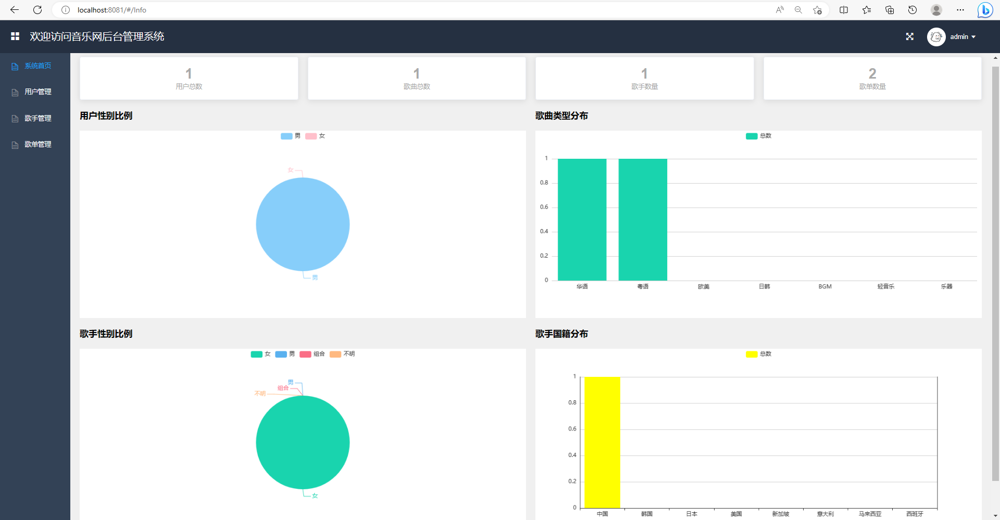
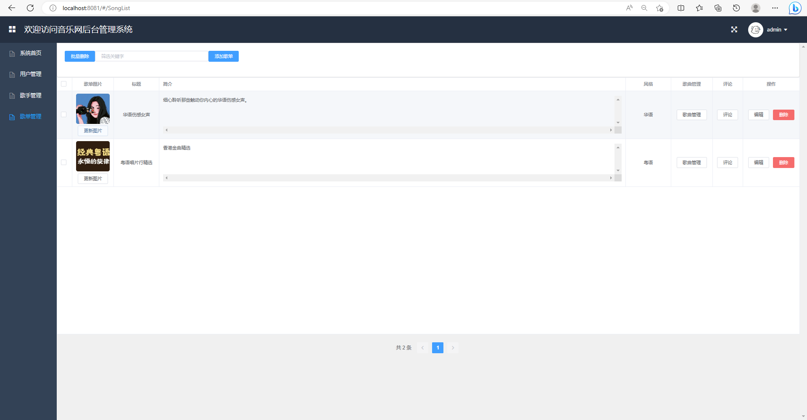
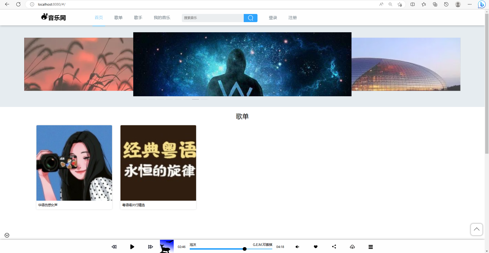
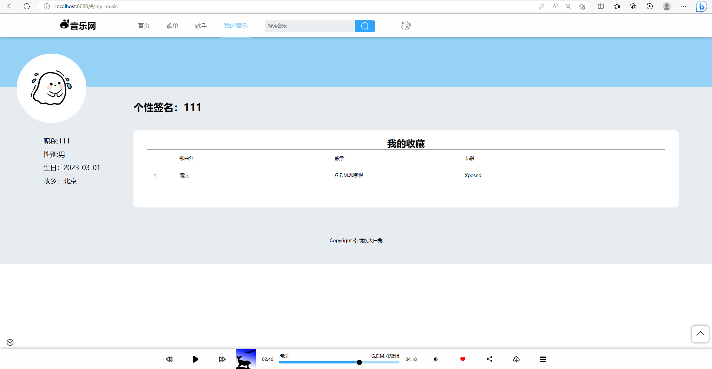
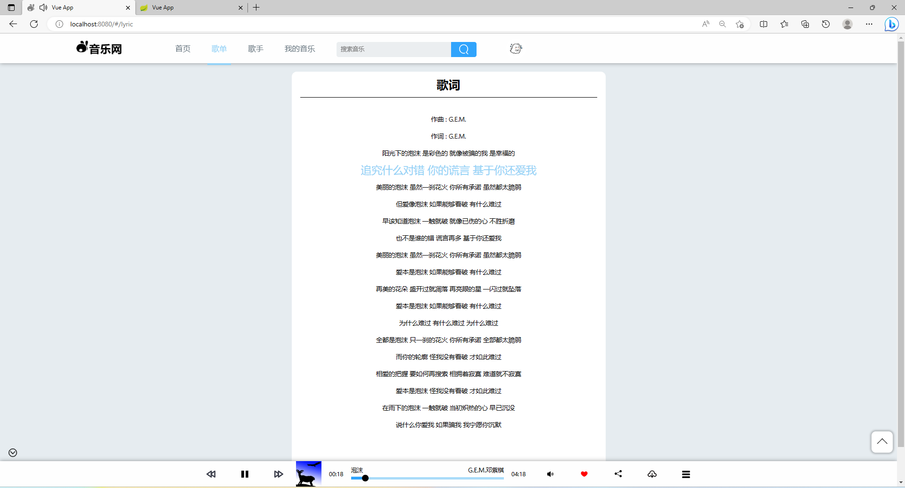

# 在线音乐网站

## 一、介绍

基于SpringBoot，Mybatis，Vue的前后端分离音乐在线系统网站

开发语言：java

数据库:mysql

功能介绍

1、音乐播放

2、用户登录注册

3、用户信息编辑、头像修改

4、歌曲、歌单搜索

5、歌单打分

6、歌单、歌曲评论

7、歌单列表、歌手列表分页显示

8、歌词同步显示

9、音乐收藏、下载、拖动控制、音量控制

10后台对用户、歌曲、歌手、歌单信息的管理

### 完整项目获取

通过网盘分享的文件：音乐系统

链接: https://pan.baidu.com/s/1Eh391ZFv5wSYQKe_XCtSFg?pwd=47qx 提取码: 47qx
--来自百度网盘超级会员v3的分享

通过网盘分享的文件：工具包

链接: https://pan.baidu.com/s/1YmdoJvkjoUjA75wvHLDZ6A?pwd=xm96 提取码: xm96
--来自百度网盘超级会员v3的分享

通过网盘分享的文件：远程调试部署联系方式

链接: https://pan.baidu.com/s/1W0dDcoZmayG0c7USJDYBYg?pwd=nqd7 提取码: nqd7
--来自百度网盘超级会员v3的分享

## 二、系统部分功能界面展示

